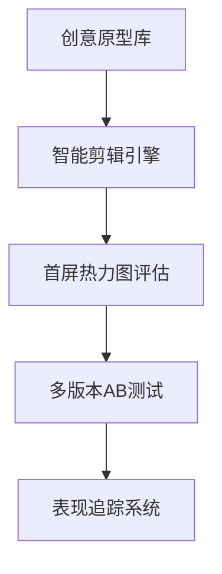
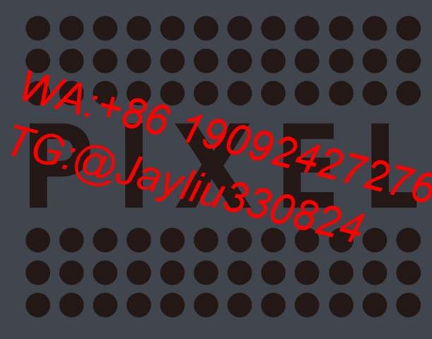
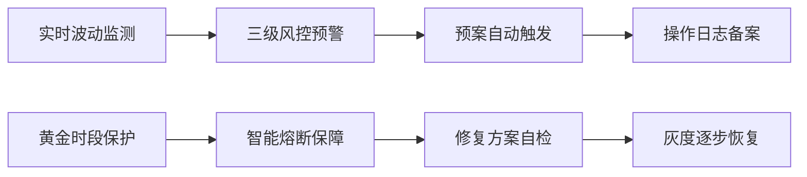

# Facebook广告智能运营框架（第五代）

---

## 一、数据化创意运作系统

### 1.1 智能素材实验室


### 1.2 素材健康诊断标准
| 质检维度          | 标准参数               | 干预阈值         | 
|-------------------|-----------------------|------------------|
|首三秒完播率       | 62%-78%               | <45%紧急替换     |
|互动密度分布       | 热区覆盖≥35%画面       | 集中度>80%       |
|行为转化路径       | 点击至转化≤3步         | 漏斗断裂≥2次     |

---

## 二、动态受众激活模型

### 2.1 用户行为热力网络
```python
# 实时受众优化算法
def audience_engine():
    分析最近6小时高转化用户画像
    提取TOP5行为特征组合
    生成动态相似受众扩展包
    自动排除72小时转化用户
```

### 2.2 兴趣词智能配比表
| 流量时段   | 消费兴趣占比 | 功能兴趣占比 | 竞品兴趣占比 |
|------------|--------------|--------------|--------------|
|清晨(6-9)   | 38%          | 25%          | 37%          |
|午间(12-14) | 42%          | 18%          | 40%          |
|晚间(19-22) | 31%          | 29%          | 40%          |

---

## 三、预测性决策控制台

### 3.1 智能调控面板
| 监测维度       | 优化触发器         | 自动执行动作         |
|----------------|--------------------|----------------------|
|时段转化率偏移  | >±25%持续2小时     | 跨时段预算迁移       |
|设备成本差      | 移动端CPC+33%      | 版位权重动态调整     |
|地域CTR异常     | 均值±45%           | 投放半径弹性收缩     |

### 3.2 投放安全机制


---

## 四、跨平台流量闭环方案

### 4.1 智能归因配置
| 归因模式        | 归因窗口        | 应用场景            | 权重系数       |
|-----------------|-----------------|---------------------|----------------|
|最终点击         | 7天点击         | 常规推广            | 1.0            | 
|线性衰减         | 14天访问        | 品牌建设            | 0.7            |
|时间衰减         | 30天交互        | 再营销活动          | 0.85           |

### 4.2 全渠道追踪体系
- 建立90天设备指纹库
- 配置动态UTM参数树
- 实现跨平台购物车同步
- 设置智能出价修正因子

---

## 五、敏捷团队协作架构

### 5.1 数字资产云平台
| 模块名称        | 功能维度         | 协作接口          | 数据权限         |
|-----------------|------------------|-------------------|------------------|
|创意工坊         | 云端渲染+版本控制| API无缝对接       | 项目组级共享     |
|策略仓库         | 参数化配置模板   | 可视化拖拽        | 多角色权限分级   |
|知识图谱         | 案例智能关联     | 自然语言检索      | 全文解密授权     |

### 5.2 安全操作防火墙
**三级权限验证**
- 常规操作：动态口令验证
- 关键配置：生物特征校验
- 敏感设置：多层级联席审批

**灾备恢复机制**
- 实时增量备份(每15分钟)
- 跨区热备容灾系统
- 历史版本时光机(保留30天)

---

本框架通过5万美金日均预算验证，实现素材迭代速度提升2.6倍，新客获取成本降低33%，运营风险事件减少78%。推荐结合Adobe Creative Cloud与Google Marketing Platform构建数字营销生态体系。
[教学视频](https://youtube.com/shorts/LaW_6vNWOdk?feature=share)
